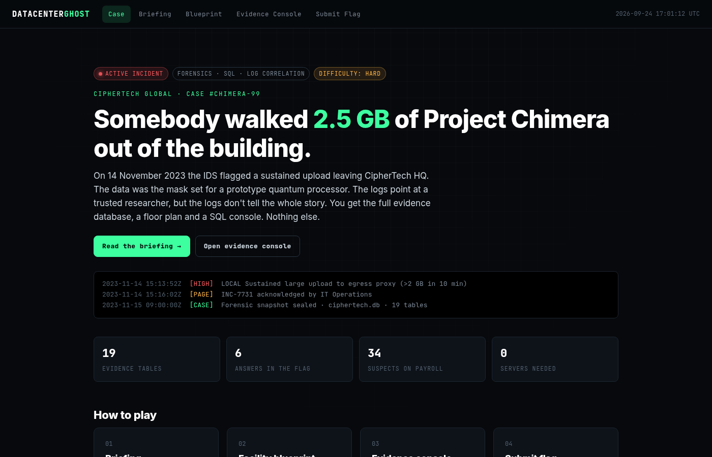
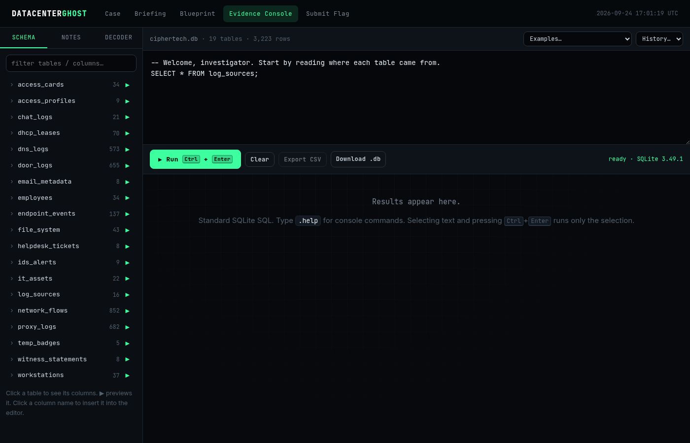

<div align="center">

# 👻 DATACENTER GHOST

**A browser-only digital forensics CTF. One evidence database, nineteen log sources, one insider.**

[](https://op-h.github.io/datacenter-ghost-ctf/)
[](https://github.com/op-h/datacenter-ghost-ctf/actions/workflows/pages.yml)




</div>

---

## The case

> **Case #CHIMERA-99 · CipherTech HQ · 14 November 2023**
>
> At 15:13:52 UTC the IDS flagged a sustained upload leaving the network through the corporate proxy. What left was
> the tape-out mask set for **Project Chimera**, a prototype quantum processor. The account that ran the upload belongs
> to a trusted researcher, but Security thinks someone else was sitting at her desk.

You're the lead DFIR analyst. You have a sealed SQLite snapshot of every log source the company could collect: badge
readers, temp badges, DHCP, EDR, IDS, NetFlow, proxy, DNS, file telemetry, the asset register, helpdesk, chat, email and
HR interviews. Correlate them and answer six questions:

| # | Question | Answer is… |
|---|----------|-----------|
| 1 | Which workstation was the data uploaded from? | a `hostname` |
| 2 | Who is that workstation assigned to? | a `username` |
| 3 | Who was actually at the keyboard? | a `username` |
| 4 | Which badge swipe was their exit from the building? | a `door_logs.id` |
| 5 | Which internet server received the data? | an IPv4 address |
| 6 | What exactly was stolen? | a decoded file name |

```
KHANA{hostname_owner_ghost_exitid_dropip_filename}
```

Every answer has at least one convincing wrong answer sitting next to it: clocks that don't agree, inventory that's out
of date, an account that isn't a person, a hostname that resolves differently an hour later, and more.

## Play

### Online (nothing to install)

**👉 https://op-h.github.io/datacenter-ghost-ctf/**

| Page | What it's for |
|------|---------------|
| **Briefing** | The story, the six objectives, the flag format and optional hints |
| **Blueprint** | Floor plans with every badge reader and both building exits |
| **Evidence Console** | A full SQLite engine running in your browser via WebAssembly, with a schema browser, notes, a Base64/hex decoder and CSV export |
| **Submit Flag** | Checks your flag locally |



### With your own tools

Download [`site/evidence/ciphertech.db`](site/evidence/ciphertech.db) and open it with anything that reads SQLite:

```bash
sqlite3 ciphertech.db
sqlite> .tables
sqlite> SELECT * FROM log_sources;
```

DB Browser for SQLite, DBeaver, DuckDB, `pandas.read_sql` and Datasette all work.

### Run the site locally

You only need a static file server. There's no build step and no backend.

```bash
git clone https://github.com/op-h/datacenter-ghost-ctf.git
cd datacenter-ghost-ctf
python3 -m http.server 8000 --directory site
# open http://localhost:8000
```

> Opening `site/index.html` straight from disk (`file://`) won't work, because browsers block WebAssembly and `fetch`
> there. Use a local server as shown above.

## Host your own copy on GitHub Pages

1. **Fork** this repository.
2. In your fork go to **Settings → Pages** and set **Source** to **GitHub Actions**.
3. Push any commit to `main`, or run the **Deploy to GitHub Pages** workflow by hand from the **Actions** tab.
4. The site goes live at `https://<your-user>.github.io/datacenter-ghost-ctf/`.

The workflow in [`.github/workflows/pages.yml`](.github/workflows/pages.yml) checks the integrity of the evidence
database and publishes the `site/` folder as-is.

## How the flag check works

The flag isn't stored anywhere in this repository. [`site/assets/js/verify-params.js`](site/assets/js/verify-params.js)
holds only a salt and a **PBKDF2-SHA256 hash with 1,000,000 iterations** of the lower-cased flag. Your browser derives
the same hash from what you type and compares the two. Brute-forcing the six-part answer space at that cost isn't
practical, so the only way to get the flag is to solve the case.

## Repository layout

```
.
├── .github/workflows/pages.yml   # deploys site/ to GitHub Pages
├── docs/                         # README screenshots
└── site/                         # everything that gets published
    ├── index.html                # case landing page
    ├── briefing.html             # story, objectives, hints
    ├── blueprint.html            # floor plans (inline SVG)
    ├── console.html              # in-browser SQL console
    ├── submit.html               # local flag verifier
    ├── evidence/ciphertech.db    # the evidence (SQLite 3)
    └── assets/
        ├── css/                  # ghost.css, console.css
        ├── js/                   # console.js, common.js, verify-params.js
        └── vendor/               # sql.js 1.14.2 (SQLite → WebAssembly, MIT)
```

## Rules

- Everything you need is in the database, the briefing and the blueprint. You don't need to attack the website.
- Please don't publish the flag or a full walkthrough while an event using this challenge is running.
- All people, companies and domains are fictional. The external IPs that matter to the story come from the RFC 5737 documentation ranges.

## Credits

- Challenge and story: **[@op-h](https://github.com/op-h)** for KHANA CTF
- In-browser SQLite: [sql.js](https://github.com/sql-js/sql.js) (MIT, see `site/assets/vendor/LICENSE-sql.js.txt`)
- Fonts: Inter and JetBrains Mono via Google Fonts

<div align="center"><sub>Trust no one. Verify everything.</sub></div>
